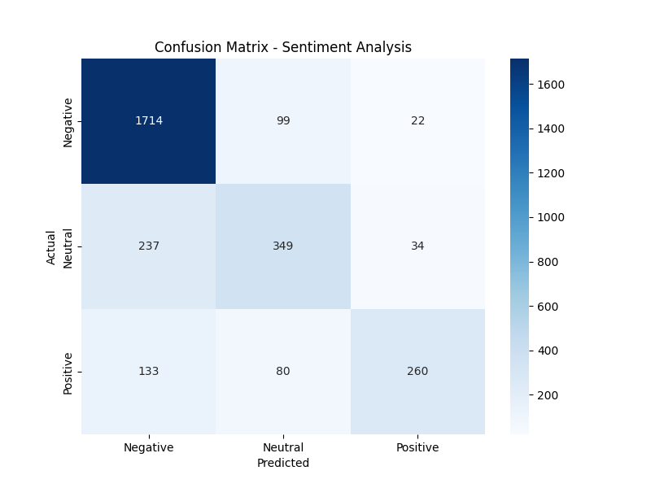

#  Social Media Sentiment Analyzer

##  Project Overview
Machine Learning project that analyzes social media posts (tweets, reviews, comments) to detect sentiment: **Positive, Negative, or Neutral**.

##  Dataset
- **Source:** Twitter US Airline Sentiment (Kaggle)
- **Total tweets:** 14,640
- **Distribution:** 
  - Negative: 63% (9,178 tweets)
  - Neutral: 21% (3,099 tweets)
  - Positive: 16% (2,363 tweets)

##  Model Performance

| Metric | Score |
|--------|-------|
| **Accuracy** | 79.34% |
| **Precision** | 76.87% |
| **Recall** | 68.22% |
| **F1-Score** | 71.39% |

### Confusion Matrix


##  Project Files
| File | Description |
|------|-------------|
| `train_model.py` | Model training code |
| `app.py` | Streamlit web application |
| `Tweets.csv` | Dataset (14,640 tweets) |
| `sentiment_model.pkl` | Trained Logistic Regression model |
| `vectorizer.pkl` | TF-IDF vectorizer |
| `confusion_matrix.png` | Confusion matrix visualization |

##  How to Run

```bash
# 1. Install dependencies
pip install streamlit pandas scikit-learn nltk matplotlib seaborn

# 2. Run the web app
streamlit run app.py

## Tech Stack
Language: Python

ML Libraries: Scikit-learn, NLTK, Pandas

Frontend: Streamlit

Model: Logistic Regression

Feature Extraction: TF-IDF

## Results
 Successfully detects sentiment with 79.34% accuracy

 Real-time analysis via Streamlit UI

 Works on tweets, reviews, and comments

## Author
Huzaifa Kashif
Machine Learning Project

Built with Python & Streamlit
